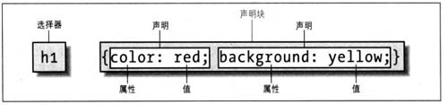

> css继承是从一个元素向后代元素传递属性值所采用的机制。确定应当向一个元素应用那些值时，浏览器不仅仅要考虑继承，还要考虑声明的特殊性，另外需要考虑声明本身的来源，这个过程就成为层叠。  ---css权威指南

上面有两个词需要注意，一个是声明，一个是特殊性。上图：



如上图中，css规则由选择器和声明块组成，写在选择器后面的大括号中的内容就是声明，特殊性既是指css优先级。

## 选择器的特殊性值

特殊性值表述为四个部分，用0,0,0,0表示

* ID选择器的特殊性值，加0,1,0,0
* 类选择器，属性选择器或者伪类，加0,0,1,0
* 元素和伪元素，加0,0,0,1
* 通配选择器*对特殊值没有贡献，即0,0,0,0
* 最后比较特殊的是!important（权重），它没有特殊性质，但是他的优先级是最高的，为了记忆，令他的特殊性值为1,0,0,0,0

选择器的特殊性值是从左到右计算的，特殊性1,0,0,0大于以0开始的所有特殊性值，即使是0,99,99,99

另外需要注意的两点是：
* 元素继承过来的规则优先级，是小于通配符所定义的优先级的
* 行间样式，即内联样式的规则特殊性值为1,0,0,0

举例来看
```css
a{color: yellow;}/*特殊性值为 0,0,0,1*/
div a{color: green;}/*特殊性值为 0,0,0,2*/
.demo a{color: black;}/*特殊性值为 0,0,1,1*/
.demo input[type="text"]{color: blue;}/*特殊性值为 0,0,2,1*/
.demo *[type="text"]{color:grey;}/*特殊性值为 0,0,2,0*/
#demo a{color:yellow;}/*特殊性值为 0,1,0,1*/
div#demo a{color:red;}/*特殊性值为 0,1,0,2*/
```

## 层叠

css层叠计算的方式如下：
  css会优先查看规则的权重(!important)，加了权重的优先级最高，当权重值也相同时，会比较两条规则的特殊性值，按照前面的计算方式计算特殊性，当两条规则的特殊性也一样时，会根据声明的位置进行判断，后声明的规则值优先级较高。

我们以a标签的四种状态来说明一下，链接访问前、链接访问后、鼠标滑过、激活，分别对应的四种伪类分别为:link、:visited、:hover、:active，一般大家都会遵循“爱憎原则（LOVEHATE）”，该顺序的原理便是因为四种伪类所对应的特殊性值相同，此时便需要先后顺序来指定在特定的场合用特定的规则

当鼠标滑过a链接时，会同时满足:link、:hover两个伪类，所以:hover必须在:link后；当鼠标点击a链接时，会同时满足:link、:visited、:active，要显示激活状态的值，此时:active表需要需要在:visited后面
