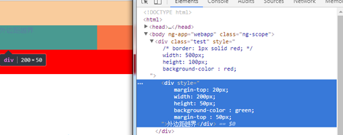

盒模型是HTML+CSS最基础的概念，在页面布局中，为了获得更好的排版，盒模型的概念是需要好好理解的。下面从几个方面分开介绍：

## 盒模型概念

CSS盒模型又称框模型，包含了内容(content)、内边距(padding)、边框(border)、外边距(margin)四个元素。看下图：

图中最内部的蓝色部分为content内容，为元素框，通常我们设置的背景就是内容，内边距和边框这部分，外边距是透明的，不会遮挡其他的元素。

这样元素框的总宽度 = 元素框的宽度(width)+padding左右宽度+border左右宽度+margin左右宽度

元素框的总高度 = 元素框的高度(height)+padding上下宽度+border左右宽度+margin左右宽度

## 外边距叠加

两个上下方向相邻的垂直相遇时，外边距会合并，合并后的高度等于发生合并的两个外边距的较高的那一个。
如下图：

注意：只有在普通文档流的边框的垂直外边距才会发生外边距叠加。行内框，浮动框，绝对定位框之间的外边距不会叠加

会发生外边距叠加的三种情况分别如下

* 当一个元素出现在另一个元素上面时，第一个元素的底外边距和第二个元素的顶外边距发生叠加
* 当一个元素出现在另一个元素内部时，第一个元素的顶外边距和第二个元素的顶外边距发生叠加
* 外边距可以与自身发生叠加。当一个元素是一个空元素，并且没有边框和内边距，该元素的顶外边距和底外边距会发生叠加

## box-sizing

box-sizing是css属性中的一种，它与和模型有关。我们都知道，CSS中的盒模型包括IE盒模型和W3C盒模型。

IE盒模型和W3C盒模型的区别在于width和height的计算方式，标准盒模型中，width和height指的是content的宽和高；而IE盒模型中的width和height则是指的是content和padding加上border后的宽和高。继而当我们计算盒模型的宽和高时也会发生变化。

box-sizing就是设置盒模型的一个属性，其值有三个，content-box|border-box|inherit

其中content-box为把盒模型设置成标准盒模型，border-box为设置成IE盒模型，inherit则规定应该从父元素中继承box-sizing属性的值。

关于border-box的使用：

* 一个box的宽度为100%，又想要两边有内边距，这时候用就比较好
* 全局设置box-sizing为border-box，首先其符合直觉，而且可以正常使用百分比宽度

## 应用

### margin越界

第一个子元素的margin-top和最后一个子元素的margin-bottom的越界问题。以第一个元素的margin-top为例：

当父元素没有边框，设置的第一个子元素的margin-top会自动附加给父元素的现象，成为越界。

如上图所示，此时出现了bug，我们可以通过以下几种方式解决

* 给父元素添加border(有负影响)
* 给父元素padding(有负影响)
* 给父元素添加 overflow:hidden(有负影响)
* 父元素加前置内容生成(推荐)，例
```css
.parent:before{
  content: '';
  display: table;
}
```
更正后如下图所示


### 浏览器中的盒模型问题

* ul标签在Mozilla浏览器中默认是有padding值的，而在IE中只有margin值
* 标准盒模型与IE盒模型的差异

### 用盒模型画三角
```css
.triangle{
  width: 0;
  height: 0;
  border: 100px solid transparent;
  border-top: 100px solid;
}
```
效果如图：

