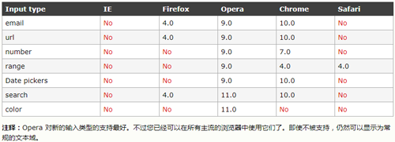

2014年，html5规范标准制定成功。HTML5设计已经不再基于SGML，其主要目的是为了在移动设备上支持多媒体，下面就HTML5新增变化做个总结

HTML5技术主要是关于图像、位置、存储、多任务等功能的增加，目前浏览器支持部分HTML5技术，各浏览器之间略微差异，下面就歌技术以及其兼容情况做一个简要的概括

## canvas

canvas就像一块幕布，可以用JavaScript在上面绘制各种图表，动画等，成为了flash的可替代性方案。

canvas基础功能在各浏览器的兼容问题如下图：


一个canvas定义了一个指定尺寸的矩形框，我们可以在矩形框内随意绘制。
```html
<canvas id="test-canvas" width="300" height="200">
  <p>你的浏览器不支持Canvas</p>
</canvas>
```
在使用canvas前，使用`canvas.getContext()`判断是否被浏览器支持

具体使用参考网上，这里不再赘述

## video和audio

使用教程略简单，具体见[w3c教程](http://www.w3school.com.cn/html5/html_5_video.asp)

浏览器支持方面，video与audio基本一致


## 拖放

拖放(Drag和Drop)是Html5标准的组成部分，任何元素都可以被拖拽。

在浏览器支持方面，Internet Explorer 9、Firefox、Opera 12、Chrome 以及 Safari 5 支持拖放。
  注释：在 Safari 5.1.2 中不支持拖放。

使用步骤如下：
1、设置元素为可拖动
```html

```
2、规定当元素被拖动时，会发生什么
```html

```
dataTransfer.setData()方法设置被拖动数据的数据类型和值
```javascript
function drag(ev){
  ev.dataTransfer.setData("Text", ev.target.id)
}
```
3、放在何处和进行放置---ondragover和ondrop
```html
<div class="" ondragover="allowDrop(event)" ondrop="drop(event)"></div>
```
这里默认无法将数据或元素放置到其他元素中，如果需要设置允许，必须设置阻止浏览器默认处理方式
drop方法中也需要阻止浏览器默认处理方式，因为drop事件的默认处理方式以链接形式打开
```javascript
function allowDrop(ev){
  ev.preventDefault();
}
function drop(ev){
  ev.preventDefault();
  var data = ev.dataTransfer.getData("Text");
  ev.target.appendChild(document.getElementById(data))
}
```

## 表单

html5表单新增了输入类型，提供了更好的输入控制和验证

主要新增类型和其兼容性如图



其中date-picker包括date, month, week, time, datetime, datetime-local

html5还新增了一些表单元素（datalist, keygen,output）以及表单属性，不过目前浏览器支持性一般，慎用

表单属性中autocomplete属性已得到大多数浏览器的支持，该属性规定form和input具有自动完成的功能。
在某些浏览器中可能需要手动的设置autocomplete="on"来开启自动完成功能，通过autocomplete="off"来关闭

## 语义化

在HTML5之前，基本上全部使用div进行布局，html5新增了很多标签，提倡使用正确的标签做正确的事，即语义化

HTML语义化的优势在于：
* 页面的内容结构化，结构更清晰，便于对浏览器、搜索引擎解析;
* 即使在没有样式CSS情况下也以一种文档格式显示，并且是容易阅读的;
* 搜索引擎的爬虫也依赖于HTML标记来确定上下文和各个关键字的权重，利于SEO;
* 使阅读源代码的人对网站更容易将网站分块，便于阅读维护理解。

html5新增的语义化标签包括header,footer,section,nav,aside,artical,hgroup(代表网页或section的标题)
具体使用见[语义化标签](http://www.html5jscss.com/html5-semantics-section.html)

## 本地存储

### localStorage和seesionStorage

在HTML5之前，Cookie存储成为主流，可是Cookie众所周知的几大限制促使了localStorage和sessionStorage的产生

cookie的缺陷：
* 存储大小限制，大多数浏览器支持最大4KB字节的内容
* 浏览器限制用户在计算机上存储cookie的数量，不能大于20个
* cookie默认情况下会随着http的请求头发送到服务器，造成流量的增加

Html5提供localStorage(永久的数据存储，除非手动进行删除)和sessionStorage(针对一个session的数据存储，关闭页面会删除)

web存储只是保存到本地，不会随着请求传送到服务器，不过其也有局限的地方：
* 大多数浏览器在每个域名下不能存储大于5M的内容
* 以key-value形式存储，value值只能存储字符串，所以对象一般会转成字符串进行保存

### 本地数据库

这是一个浏览器端的数据库，在本地数据库我们可以直接利用JavaScript创建数据库，并利用SQL语句进行CRUD操作

操作本地数据库的步骤是：
1、openDatabase方法，创建一个数据库对象
```javascript
var dataBase = openDatabase('student', '1.0', '学生表', 1024*1024, function(){})
```
2、开启事务transaction来设置一个事件响应方法，在事件响应中通过excuteSql执行CRUD
```javascript
dataBase.transaction(function(ctx){
  ctx.excuteSql('CREATE TABLE IF NOT EXISTS testTable (id unique, name)');
  ctx.executeSql('INSERT INTO testTable (id, name) VALUES (0, "Byron")');  
})
```

## 离线存储

HTML5引入了应用程序缓存，即离线存储，这样即使在离线的时候，用户也可以正常访问app
浏览器对缓存的容量进行设置，某些浏览器设为5MB。离线缓存基本流程为


当第一次访问设置有manifest属性的站点时，会缓存所需要的文件到本地；当再次访问时，浏览器首先会访问离线应用，然后检查manifest文件是否更新，如果没有更改，则显示缓存的内容，如果发生改变，则按照manifest的规则重新从服务器上拉取文件到本地，并更新页面内容。

### 如何使用

html标签新增了一个manifest属性，可以用来指定当前页面的manifest文件
```html
<!DOCTYPE html>
<html manifest="demo.appcache">
  <head>
    <meta charset="utf-8">
    <title></title>
  </head>
  <body>
  </body>
</html>
```
每个指定了manifest属性的页面在用户对其访问时都会进行缓存
  ps：这里需要注意manifest文件需要在web服务器上设置正确的mime类型，即"text/cache-manifest"

manifest文件时简单的文本文件，他告知浏览器需要缓存那些文件以及不需要缓存那些文件，主要内容包括三个
* CACHE MANIFEST  在此标题下列出的文件将在首次下载后进行缓存
* NETWORK         在此标题下列出的文件需要与服务器的连接，且不会被缓存，可以使用星号来指示所有其他资源/文件都需要因特网连接
* FALLBACK        在此标题下列出的文件规定当页面无法访问时的回退页面（比如 404 页面）

### 更新缓存
一旦应用被缓存，他就会保持缓存直到发生下列情况：
* 用户清空浏览器缓存
* manifest文件发生变化
* JS程序手动更新应用缓存

离线缓存的优点在于：
* 可以离线浏览，用户在断网的时候依然可以访问应用
* 因为数据被缓存到本地，如果内容没有变化的话，可以增快访问的速度
* 可以减轻浏览器的负载

注意事项为：
* 浏览器对离线缓存的文件大小进行了限制，并且不同浏览器有略微区别
* 如果manifest文件，或者需缓存的文件下载失败，则会使用老的缓存文件
* 使用manifest的HTML必须与需缓存的文件（包括FALLBACK文件）同源
* 站点中的其他页面，即使没有设置manefest，如果缓存中有数据，也会优先从缓存中读取
* 更新缓存的触发条件需要注意

## 地理定位

HTML5 GeoLocation API用于获得用户的地理位置

浏览器支持情况
Internet Explorer 9、Firefox、Chrome、Safari 以及 Opera 支持地理定位。
注释：对于拥有 GPS 的设备，比如 iPhone，地理定位更加精确

GeoLocationAPI主要是 getCurrentPosition()方法，用于获取用户的地理位置
当然还有 watchPosition()，返回用户当前位置，并继续返回用户移动时的更新位置
```javascript
function getLocation(){
  if(navigator.geolocation){
    navigator.geolocation.getCurrentPosition(function(currentPos){
      console.log(currentPos.coords.latitude, currentPos.coords.longitude)
    })
  }else{
    console.log('Geolocation is not supported by this browser.')
  }
}
```

## WebWorker

WebWorker为Web内容在后台线程中运行脚本提供了一个简单的方法。线程可以执行任务而不干扰用户界面。一旦创建WenWorker，一个worker可以将消息发送给创建它的JS代码，然后进入事件处理程序（反之亦然）。

在worker线程中你可以运行任何你喜欢的代码，不过也有例外，worker中不能直接操作DOM，或者使用window对象的属性和方法，setTimeout和SetInterval是例外。

workers和主线程间的数据传递通过这样的消息机制进行——双方都使用postMessage()方法发送各自的消息，使用onmessage事件处理函数来响应消息（消息被包含在Message事件的data属性中）。这个过程中数据并不是被共享而是被复制。

其浏览器兼容情况如下图


具体分析见[Web Worker你必须知道的7件事](http://blog.csdn.net/dojotoolkit/article/details/25030289)

## WebSocket

具体见[阮一峰](http://www.ruanyifeng.com/blog/2017/05/websocket.html)
