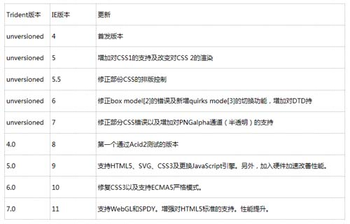
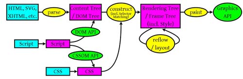
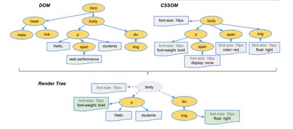

所谓的"浏览器内核"无非指的是一个浏览器最核心的部分-----“Rendering Engine”，就是渲染引擎，我们也常称为“排版引擎”、“解释引擎”，这个引擎的作用就是帮助浏览器渲染网页的内容，将页面内容和排版代码转换为用户所见的视图。

## 浏览器内核

有时候我们所说的浏览器内核甚至是渲染引擎，其实除了渲染引擎之外，也包含了javascript引擎，如webkit，她由渲染引擎WebCore和Js引擎JSCore组成

我们常用的浏览器内核有很多，如Trident，Gecko，Webkit等，不同浏览器内核对网页编写语法的解释不同，进而导致了同一个页面在不同内核的浏览器下显示的效果不同，这也是前端工程师需要让作品兼容各种浏览器的原因。

下面就几种浏览器内核做一下简单的介绍：

### Internet Explorer

IE开发计划开始于1994年夏天，微软为了抵抗当时主流的网景Netscape Navigator,要在Windows中开发适合自己的浏览器，所以与Spyglass合作，于是IE从早期一款商业性的专利网页浏览器Spyglass Mosaic派生出来。

96年，微软从Spyglass取得了Spyglass Mosaic的源代码和授权，从而是IE逐渐成为微软专属软件，它采用的版本是Trident内核，下面是Trident版本信息：

IE所使用的JS引擎
Chakra：中文译名为查克拉，用于Internet Explorer 9的32位版本及IE10+。

### Safari

Safari为苹果公司开发的浏览器，使用了KDA(Linux桌面程序)的KHTML作为浏览器的运算核心，Safari所使用的浏览器内核就是Webkit。

WebKit的前身是KDA小组的KHTML引擎，Webkit引擎由渲染引擎WebCore和Js引擎JSCore组成。

### Chrome / Chromium

谷歌Chrome/Chromium浏览器从08年至今一直使用苹果公司的Webkit作为浏览器内核，是Webkit的一个分支，我们也称为Chromium引擎

13年发布的Chrome 28放弃了Chromium引擎转而使用最新的Blink引擎(基于WebKit2)

V8：开源，由Google丹麦开发，是Google Chrome的一部分，其为Chrome所使用的JS引擎，这就是Chrome比Safari在JS测试中效率更高的原因。

### Opera

Opera浏览器，是一款挪威Opera Software ASA公司制作的支持多页面标签式浏览的网络浏览器。是跨平台浏览器可以在Windows、Mac和Linux三个操作系统平台上运行。

Opera7.0是Opera里程碑的作品，因为其使用了Opera自主研发的Presto渲染引擎，Presto加入了动态功能，例如网页或其部分可随着DOM及Script语法的事件而重新排版，使得其成为当时速度最快的引擎，不过代价是兼容性降低

2013年，Opera为了减少研发成本，转而跟随Chrome使用Webkit分支的Chromium引擎作为自家浏览器核心引擎，随后也转而使用Blink引擎。

Opera使用JS引擎
Futhark：用于Opera 9.5～10.2版本。
Carakan：由Opera软件公司编写，自Opera10.50版本开始使用。

### FireFox

Mozilla Firefox是一个开源网页浏览器，98年，Mozilla计划有网景公司开始执行，被命名为Gecko。

2003年，网景公司解散，同一天，Mozilla基金会成立，继续推动Gecko的发展，时至今天，Gecko仍继续由Mozilla的雇员和义工所维护和发展。

Firefox 所使用的JS引擎变化如下：

SpiderMonkey：第一款JavaScript引擎，由Brendan Eich在Netscape Communications时编写，用于Mozilla Firefox 1.0～3.0版本。
Rhino：由Mozilla基金会管理，开放源代码，完全以Java编写。
TraceMonkey：基于实时编译的引擎，其中部份代码取自Tamarin引擎，用于Mozilla Firefox 3.5～3.6版本。
JaegerMonkey：德文Jäger原意为猎人，结合追踪和组合码技术大幅提高性能，部分技术借凿了V8、JavaScriptCore、WebKit：用于Mozilla Firefox 4.0以上版本。
IonMonkey：可以对JavaScript编译后的结果进行优化，用于Mozilla Firefox 18.0以上版本。
OdinMonkey：可以对asm.js进行优化，用于Mozilla Firefox 22.0以上版本。

## 浏览器内核渲染原理

浏览器渲染大体可以分为以下五步：
1、处理HTML生成DOM Tree
2、处理css生成CSSOM Tree
3、DOM树与CSSOM树合并为Render树
4、对Render树进行布局计算
5、遍历Render树的每一个节点会知道屏幕

从图中可以看出：

1）浏览器回解析三个元素
* HTML/SVG/XHTML等，产生DOM树
* CSS，解析CSS产生CSS规则树
* JavaScript脚本，主要是通过DOM API和CSSOM API来操作DOM Tree和CSS Rule Tree

当浏览器获得一个HTML文件时，会自上而下加载，并在加载过程中进行渲染。

2）解析完成后，浏览器引擎会通过DOM Tree和CSS Rule Tree来构造Rendering Tree。

* Rendering树不等于DOM树，因为像Header或者display为none的元素并没有在渲染树中
* CSS Rule Tree主要是为了完成匹配并把CSS规则附加上Render Tree上的每一个Element，也就是DOM节点上

有了Render树，浏览器已经能知道网页中有哪些节点以及各个节点以及他们的从属关系，然后，计算每一个节点的位置，这就是渲染过程。

3）最后通过调用操作系统Native GUI的API绘制

上述的这个过程是逐步完成的，为了更好的用户体验，渲染引擎会将可能的将内容呈现在屏幕上，并不会等到所有的HTML都解析完成之后再去构建和布局render tree。

它是解析完一部分内容就显示一部分内容，同时可能还通过网络下载其他内容。

详细见参考
[浏览器的渲染原理](https://www.cnblogs.com/yc-755909659/p/6599553.html)
[浏览器内核](http://blog.csdn.net/curiousL/article/details/53409869)
