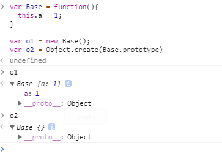
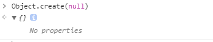

针对Object.create()和new的不同，我们通过代码来看：

```javascript
var Base = function(){
  this.a = 1;
}

var o1 = new Base();
var o2 = Object.create(Base.prototype)

```

我们输出o1和o2来看一下结果



我们可以一目了然，通过Object.create创建对象时，失去了Base构造函数本身的属性。下面我们来看一下MDN上对Object.create的定义。

## Object.create()

Object.create()方法会使用指定的原型对象及其属性去创建一个新的对象。语法为

> Object.create(proto[, propertiesObject])

其中proto为新创建对象的原型，可选的第二个参数则是要添加到新创建对象的可枚举属性对象的属性描述符以及相应的属性名称。

返回一个在指定原型对象上添加属性后的对象。

通过这里我们可以理解上述例子中通过Object.create创建后对象中为什么没有a属性了。

下面我们通过Object.create来实现继承

```javascript
function Shape(){
  this.x = 0;
  this.y = 0;
}

Shape.prototype.move = function(x, y){
  this.x += x;
  this.y += y;
  console.log('Shape moved!')
}

function Rectangle(){
  Shape.call(this)
}

// 子类继承父类
Rectangle.prototype = Object.create(Shape.prototype);
Rectangle.prototype.constructor = Rectangle;
// 使用.prototype = ...后，constructor会改变为 = ... 后面的那个，
// 多以需要重新指定constructor
```

## new 运算符

这里可以参考大神[JavaScript深入之new的模拟实现](https://github.com/mqyqingfeng/Blog/issues/13)进行理解。

顾名思义，new是可以访问到构造函数中的属性的，也可以访问到其构造函数原型的属性。

这是Object.create()和new的第一个区别。

第二个区别是可以通过Object.create(null)新建一个内在属性[[Prototype]]指向null的对象。

。

以上就是create和new的主要区别，在实例化和继承的过程中，尽量选用Object.create来实现。