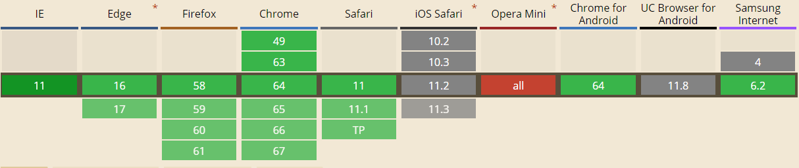

DNS Prefetch, 即DNS预解析。

一般来说，与DNS相关的前端优化主要有两点，一是减少DNS的请求数，二就是DNS预解析。

## DNS

DNS全程是Domain Name System，即域名系统，是域名和IP地址相互映射的一个分布式数据库。

域名解析即通过主机名，最终得到该主机名对应的IP地址的过程，浏览器对网站的第一次域名DNS解析查找流程依次为：

> 浏览器缓存 -> 系统缓存 -> 路由器缓存 -> ISP DNS缓存 -> 递归搜索

典型的一次DNS解析需要耗时20-120ms。

所以为了减少用户的等待时间，提升用户的体验，DNS预解析便被提出了

## DNS预解析

当我们在浏览网页的时候，浏览器会在加载网页时对网页中的域名进行解析缓存，这样当我们在点击当前页面中的域名时，就无需进行DNS解析了。

默认浏览器会对页面中和当前域名不在同一域的域名进行预获取，并且缓存结果，这就是隐式的DNS Prefeth，如果相对页面中没有出现的域名进行预获取，那么就需要使用显示的DNS Prefetch。

目前大多数浏览器都支持 DNS Prefetch，目前兼容情况如下图：



其中Chrome和Firefox3.5+内置了DNS Prefetch技术并对DNS预解析做了相应的优化设置，所以即使不设置此属性，也能自动的在后台进行预解析。

使用方法就是
```html
<!DOCTYPE html>
<html>
<head>
  <link rel="dns-prefetch" href="/解析域名">
</head>
<body>
</body>
</html>
```

不过需要注意禁止滥用，我们可以通过`<meta http-equiv="x-dns-prefetch-control" content="off">`来禁用DNS预解析功能。

下面是DNS预解析需要注意的特性：

* Chrome会记住最近使用的10个domain，并且在开启浏览器时自动解析

* Chrome使用8个线程专门做DNS Prefetching，而且Chrome本身不做dns记录的cache，是直接从操作系统中读取dns，所以直接修改系统的dns记录或者host会影响Chrome

* 浏览器会对a标签href自动启用DNS Prefetching，所以a标签的域名不需要在head中手动设置。但是在HTTPs下不起作用，需要meta强制开启功能。

dns预解析常用语以下场景中：

* 页面中的静态资源在不同的domain下，如CSS，JS或者图片等文件
* 电商网站的商品页大量载入不同domain下的商品图，如淘宝
* 手机网页
* 大型网站
* js或者服务端重定向

参考：
1. [前端优化系列之一：DNS预获取 dns-prefetch 提升页面载入速度](https://www.cnblogs.com/lhm166/articles/6073787.html)
2. [DNS预解析详解](https://www.xuanfengge.com/dns-prefetching-analysis.html)