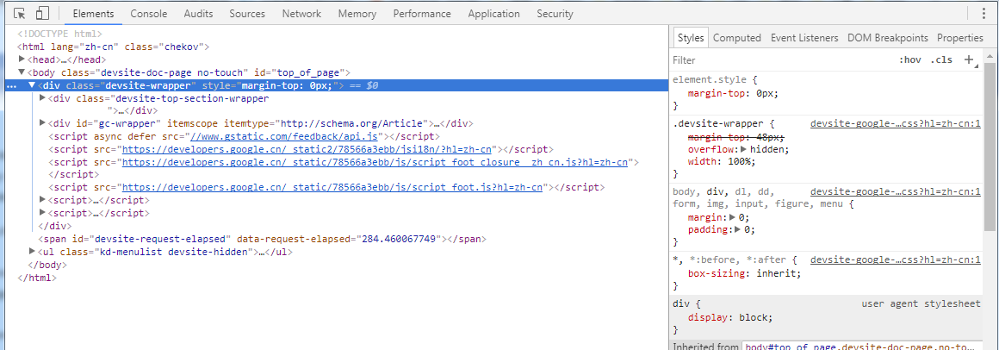
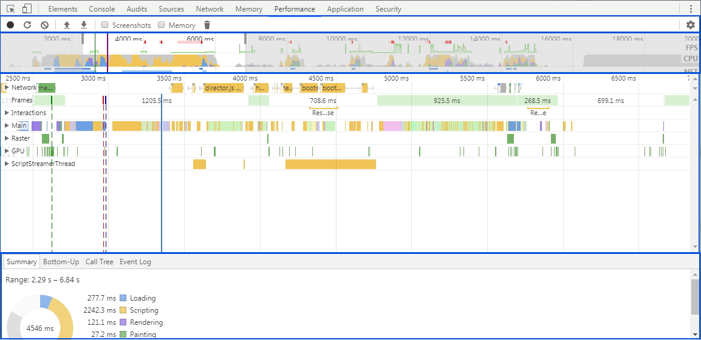

Chrome开发者工具是一套内置于Chrome浏览器的Web开发和调试工具，可用来对网站进行迭代、调试和分析。下面来具体介绍其主要的使用方法。

## 元素面板

使用元素面板（Elements）可以自由的操作DOM和CSS。

### 检查和编辑页面与样式

* 在Elements面板中检查和实时编辑DOM树的任何元素，双击元素进行更改
  1. Ctrl + Shift + C (Windows)悬停显示DOM
  2. 可通过右键Break ON设置DOM断点，有子树断点，属性断点以及移除断点，选中断点后在DOM Breakpoints窗格中显示。

* 在Styles窗格中查看和更改应用到选定元素的CSS规则，除灰色部分，所有样式均可更改
  Styles窗格显示的CSS规则，优先级由高到低，CSS规则的优先级由级联决定，级联与CSS声明被赋予的权重相关。在窗格最后显示的是继承的样式。窗格使用如下：
  1. 点击.cls按钮可以向元素中添加新类；
  2. 点击.hover启用和停用当前元素的选择器；
  3. 点击CSS属性名称或值可以编辑，选中状态下，Tab键向前移动，Shift+Tab键向后移动；
  4. 对于数字式的CSS属性值，向上键和向下键以1为增量改变值，Alt+上和Alt+下以0.1为增量，Shift+上和Shift+下以10为增量；

* 在Computed窗格中查看和修改选定元素的框模型

* Event Listeners可以查看与DOM节点相关联的JavaScript事件侦听器
  1. 右键handler，选择show Function Definition，在文件中显示事件回调位置

* 在Sources面板中查看本地对页面所做的更改，步骤如下：
  1. 在Styles窗格中，点击已修改的文件，进入Sources面板；
  2. 右键点击文件，选择 Local modifications，可以在下方看到文件样式所做的更改，以及修改时间。

撤销更改，未设置永久制作，刷新页面即可，若设置了，选到Local modifications，在文件后方有个revert，点击即可。

## 控制台面板（console）

使用控制台面板记录诊断信息，或者使用它作为shell在页面上与JavaScript交互，使用Ctrl+Shift+J (Windows / Linux)打开控制台面板
  * Ctrl+L清空控制台历史记录
  * 右键save as保存到本地log文件
  * filter正则模式过滤输出

## 源代码面板（Sources）

在源代码面板设置断点来调试Javascript，或者通过Workspaces链接本地文件来使用开发者工具的实时编辑器

  * 代码中使用debugger;与在Sources设置行内断点的作用一样， 蓝色标记；
  * 右键断点位置，Add Conditional Breakpoints，添加条件断点测试，只有条件为真时，执行断点， 橙色标记
  * Breakpoints窗格管理断点，启用禁用删除等
  * DOM变化断点，前面已经论述，有子树、属性以及移除三类断点
  * XHR断点，在XHR/fetch Breakpoints中新增url包含的某字符串
  * 事件监听断点
  * 异常断点，当文件抛出异常时触发，Pause On Caught Exceptions
  * 函数断点，debug(functionName)

## 网络面板（Network）

Network面板记录页面上每个网络操作的相关信息，包括详细的耗时数据，HTTP请求与响应头和Cookie等信息。

### Network面板概述

1. Controls，控制面板的外观和功能
2. Filters，筛选显示RequestsTable的资源，按住ctrl可选择多个
3. Overview，显示资源检索时间的时间线
4. RequestsTable，列出检索的每个资源，默认按时间排序，其中waterfall排序存在5个值，
> 分别是StartTime(请求开始时间)，ResponseTime(请求响应时间)，EndTime(请求完成时间)，TotalDuration(每个请求的总时间)，Latency(请求开始与响应开始的时间，即到响应第一个字节的时间)
5. Summary， 请求总数、传输数据量和加载时间，hrs是hours小时的缩写

### 记录网络活动

Ctrl+e或者record按钮，开始或停止记录

### DOMContentLoaded和load事件信息

Overview窗格中蓝色竖线表示DOMContentLoaded，红色竖线表示load；
Summary窗格中显示事件的确切时间

### 单个资源的详细信息

点击资源名称可查看具体信息，一般情况下有下列信息：
1. Headers， HTTP头
2. Preview， JSON、图像和文本资源的预览
3. Response， 相应数据
4. Timing， 资源请求生命周期的精细分解，查看网络耗时

针对Timing的介绍详见[Resource Timeing](https://developers.google.cn/web/tools/chrome-devtools/network-performance/understanding-resource-timing?hl=zh-cn)

常见的网络问题：
1. 已被加入队列或已被停止的系列
  表明正在从单个网域上检索太多资源，HTTP1连接上，Chrome为每个主机强制设置最多6个TCP连接，如果大于6个，前6的将开始，后面的依次加入队列，造成性能上的延迟，解决这个问题需要实现域分片，在应用上设置多个子域。HTTP2中不能使用这种方法，她消除了这种限制

2. 至第一字节的漫长时间，即waiting（TTFB）漫长，大片绿色
  建议将此值控制在200ms以下，若出现这种问题，揭示了两个主要问题
  * 客户端与服务器之间的网络环境差
  * 服务器的响应慢
  要解决TTFB，首先应尽可能的缩减网络，理想的情况下是将应用托管到本地，然后查看TTFB，若仍然很长，则需要优化应用的响应速度。可以是优化数据库查询、为特定部分内容实现缓存，或者修改网络配置。

3. 达到吞吐量能力，大片蓝色
  如果ContentDownload花费大量的时间，则需要提高服务器响应，首要的解决办法就是减少发送的字节数。
  
### 查看HTTP标头

Headers 标签可以显示资源的请求网址、HTTP 方法以及响应状态代码。 此外，该标签还会列出 HTTP 响应和请求标头、它们的值以及任何查询字符串参数。

### 查看Websocket框架

点击Frame标签可以查看websocket信息

### 网络节流

在不断变化的网络条件下，可以通过DevTools模拟不同的网络环境，可以在Control窗格中最后一个选项设置在线离线或者不同的网络环境

## 性能面板

使用性能面板可以通过记录和查看网站生命周期内发生的各种事件来提高页面的运行时性能。

分析结果如下图

如图分析：
性能分析面板分为4个部分，分别为
1. Controls，开始记录，停止记录和配置记录期间捕获的信息；
2. Overview，页面性能的高级汇总，包含三个图表，
  * FPS，每秒帧数，绿色竖线越高，FPS越高，红色块表示长时间帧，很可能出现卡顿
  * CPU，面积图指示消耗CPU资源的事件类型
  * NET，每条彩色横杠表示一个资源，横杠越长，请求资源时间越长
  > 横杠的浅色部分表示等待时间（即请求资源到第一个字节下载的时间），深色表示传输时间（下载第一个到下载结束的时间）；
  > 横杠按照以下方式进行彩色编码，HTML蓝色，脚本黄色，样式紫色，媒体文件绿色，其他灰色
3. 火焰图，CPU堆叠追踪的可视化，火焰图上三条竖线，蓝线为DOMContentLoaded，绿线表示首次绘制的时间，红线表示load事件；
4. Detail窗格，选中事件后，此窗格会显示与事件相关的更多信息

性能分析面板的更具体介绍见[性能分析](https://developers.google.cn/web/tools/chrome-devtools/evaluate-performance/timeline-tool?hl=zh-cn)

### 分析运行时性能
具体介绍见[分析运行时性能](https://developers.google.cn/web/tools/chrome-devtools/rendering-tools/?hl=zh-cn)

1. 触发大量视觉变化的JavaScript计算会降低应用性能
  使用 Chrome DevTools CPU 分析器识别开销大的函数。分析见[加速执行JavaScript](https://developers.google.cn/web/tools/chrome-devtools/rendering-tools/js-execution?hl=zh-cn)

参考链接：https://developers.google.cn/web/tools/chrome-devtools/?hl=zh-cn
