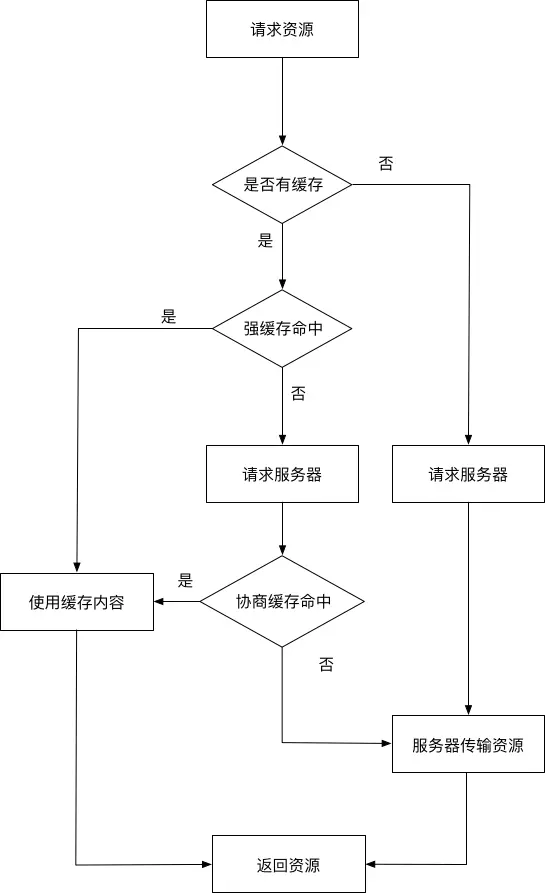

Web缓存是Web性能优化的重要手段，Web缓存分为好多种：浏览器缓存、CDN缓存、服务器缓存、数据库数据缓存。其可以为某一请求创建副本，而免于服务器资源未变时进行重复的发送请求，从而可以加快网页的打开速度，减少网络带宽，并且减轻服务器的压力。

## HTTP报文

HTTP报文就是浏览器和服务器通信时请求或者响应的数据块。浏览器向服务器发送的数据块为request请求报文， 服务器向浏览器发送的数据块为response响应报文。

报文信息主要包含两个部分：
1. header，属性的首部，包含附加信息（cookie，缓存信息）；
2. body，HTTP传输的数据内容

## 浏览器HTTP缓存机制

浏览器HTTP缓存分为强缓存和协商缓存，两者的区别是：强缓存命中的话，不会向服务器发送请求（比如Chrome的200 from memory cache），协商缓存一定会发请求到服务器，通过资源的首部字段验证资源是否命中缓存，如果命中，发挥304 not modified，简要流程如下：

### 强缓存

强制缓存命中时，我们直接使用缓存数据，不再向服务器发送请求，那么如何判定缓存是否存在的呢？

其实在没有缓存数据时，当我们第一次请求服务器，返回的相应报文中，会将缓存规则一起返回，缓存的信息存放在header中。

控制强缓存的字段以优先级介绍：

1. Pragma，Pragma是HTTP1.1之前版本的遗留，仅作为HTTP1.0的向后兼容使用，不过其在响应报文中的行为没有规范，仅依赖于浏览器的实现，RFC中该字段只有no-cache一个可用值，通知浏览器不直接使用缓存，要求向浏览器发请求验证资源是否发生变化。

2. Cache-Control， 其是一个通用首部字段，也是HTTP1.1控制浏览器缓存的主流字段。和浏览器相关的相应指令如下：

指令    |   参数    |   说明
private |   无      |  表明响应只能被单个用户缓存，不能作为共享缓存（即代理服务器不能缓存它）
public  |   可省略  |  表明响应可以被任何对象（包括：发送请求的客户端，代理服务器，等等）缓存
no-cache|   可省略  |  缓存前必需确认其有效性
no-store|   无      |  不缓存请求或响应的任何内容
max-age=[s] | 必需  |  响应的最大值

* max-age（单位为s）设置缓存的时间，相对于发送请求的时间。只有在响应报文中设置了Cache-Control为非0的max-age或者大于请求日期的Expires，才可能命中强缓存，
*注意这里的Cache-Control可以叠加使用，若想命中强缓存，也要注意不能设置了no-cache和no-store*

* no-cache 即使用协商缓存，不论是请求报文还是响应报文中出现这个字段，一定不会命中强缓存

* no-store 禁止使用缓存，适合个人隐私数据和经济类数据，一定不会出现强缓存和协商缓存

* public和private，区别在于public可以支持在代理服务器，或者CDN上缓存，private只能在浏览器端进行缓存，如果要求HTTP认证，响应自动设为private

3. Expires，他也是HTTP1.1之前版本的遗留，仅作为HTTP1.0的向后兼容使用，他指定了一个日期/时间，在这个日期范围内，HTTP强缓存被认为是有效的，如果日期无效，表示缓存过期
*注这个字段如果和max-age同时出现，该字段失效，以max-age为准*

### 协商缓存

当强缓存失效时，请求将走协商缓存路线，即发送请求到服务器，然后比对文件资源是否发生变化，如果没有变化，即命中缓存，则返回304，告知客户端用户文件并未发生改变，仍可使用保存在客户端的缓存，若文件发生变化，则将新资源作为数据发送给客户端。

控制协商缓存的字段：

* Last-Modified/If-Modified-Since， 
Last-Modified出现在响应报文中，是服务器响应请求时，告诉浏览器资源的最后修改时间；
If-Modified-Since出现在请求报文中，其值与服务器响应资源的Last-Modified值相同，浏览器发送请求时将附加上该字段，服务器将检查该资源的Last-Modified，如果Last-Modified的时间早于或等于If-Modified-Since，则返回一个不带主体的304响应，否则将重新发送资源。

* ETag/If-None-Match，优先级高于Last-Modified/If-Modified-Since
Etag是一个响应首部字段，他是根据实体内容生成的一段hash字符串，标识资源的状态，由服务端产生。
If-None-Match则是请求报文中字段，发送请求时将附加该信息，服务器接收请求后比对If-None-Match和该资源的唯一标识，不同，则说明文件被更改，返回实体内容和200状态码，相同，则返回304。

缓存具体流程如下：

参考链接：https://juejin.im/post/5a673af06fb9a01c927ed880